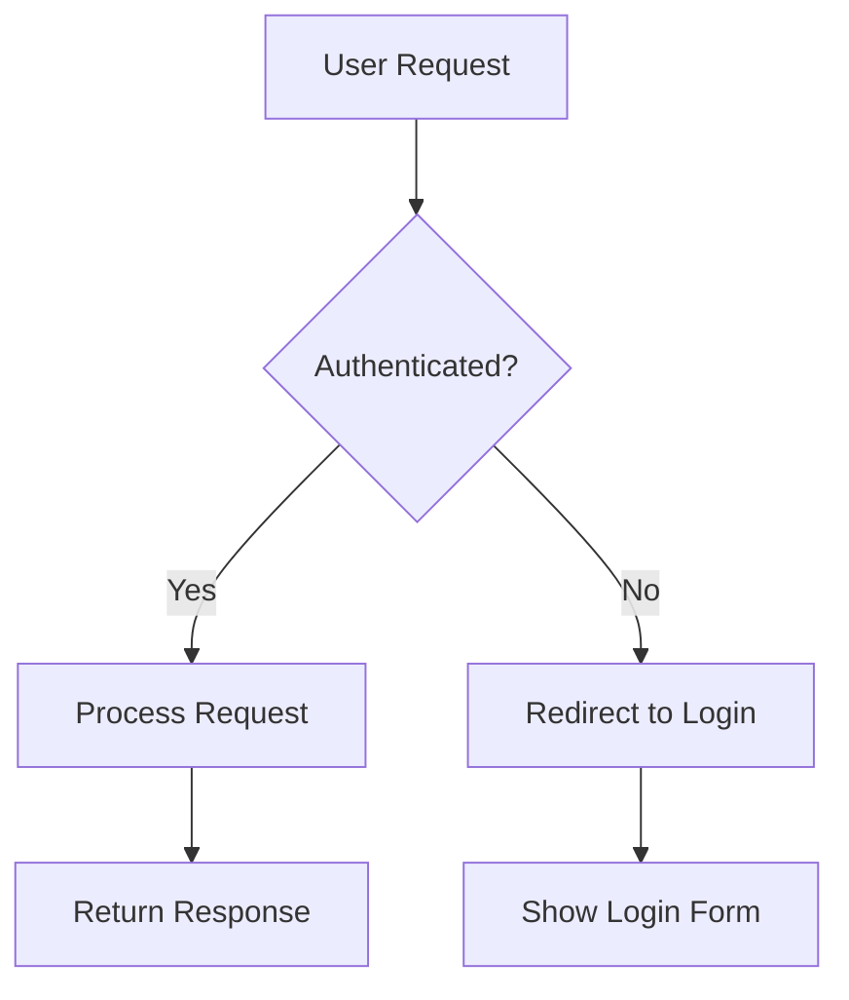
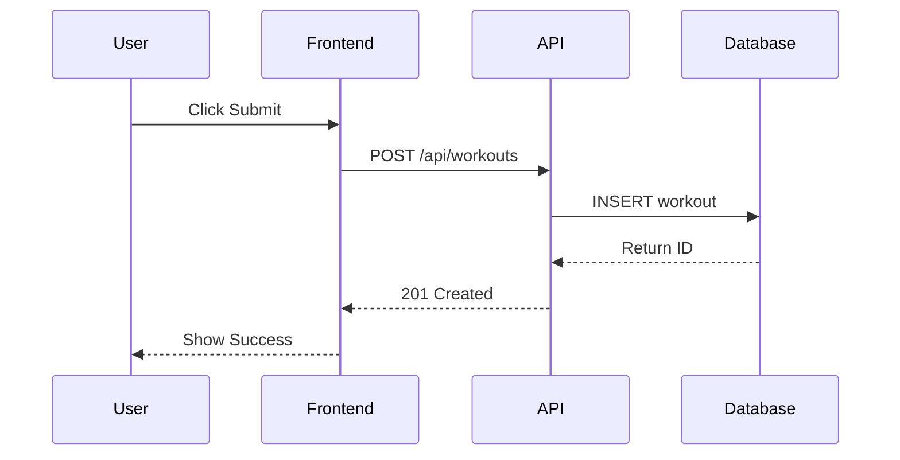
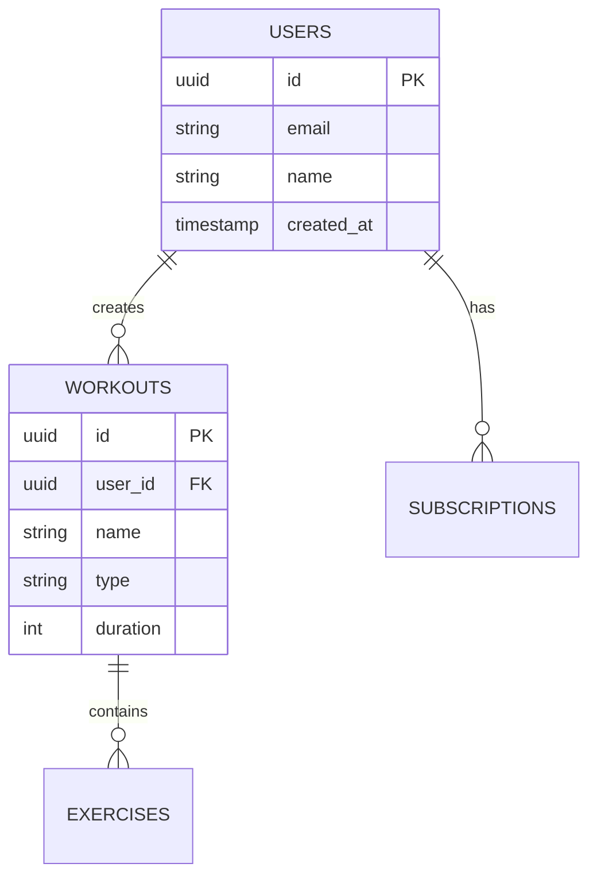
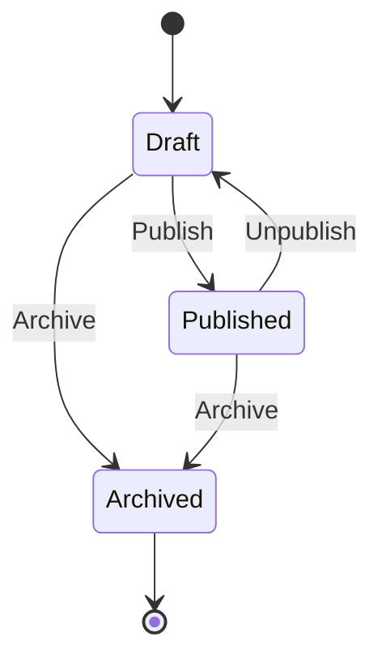

# Documentation Formats Reference

## Markdown Best Practices

### Headers
```markdown
# H1 - Page Title (one per document)
## H2 - Major sections
### H3 - Subsections
#### H4 - Minor sections (use sparingly)
```

### Code Blocks
```markdown
Inline code: `const x = 1`

Code block with language:
```typescript
function example(): string {
  return 'hello'
}
```
```

### Tables
```markdown
| Header 1 | Header 2 | Header 3 |
|----------|----------|----------|
| Cell 1   | Cell 2   | Cell 3   |
| Cell 4   | Cell 5   | Cell 6   |
```

### Lists
```markdown
Unordered:
- Item 1
- Item 2
  - Nested item

Ordered:
1. First step
2. Second step
3. Third step

Task list:
- [ ] Uncompleted task
- [x] Completed task
```

### Links and References
```markdown
[Link text](https://example.com)
[Internal link](#section-id)
[Reference link][ref]

[ref]: https://example.com "Title"
```

---

## JSDoc/TSDoc Format

### Function Documentation
```typescript
/**
 * Brief description of what the function does.
 *
 * Longer description with more details if needed.
 * Can span multiple lines.
 *
 * @param paramName - Description of parameter
 * @param [optionalParam] - Optional parameter (note brackets)
 * @param [paramWithDefault=10] - Parameter with default value
 * @returns Description of return value
 * @throws {ErrorType} Description of when this error is thrown
 *
 * @example
 * // Basic usage
 * const result = myFunction('input')
 *
 * @example
 * // With options
 * const result = myFunction('input', { option: true })
 *
 * @see RelatedFunction
 * @since 1.0.0
 * @deprecated Use newFunction instead
 */
```

### Interface Documentation
```typescript
/**
 * Represents a user in the system.
 *
 * @interface User
 * @property {string} id - Unique identifier
 * @property {string} email - User's email address
 * @property {string} [name] - Optional display name
 * @property {Date} createdAt - When the user was created
 */
interface User {
  id: string
  email: string
  name?: string
  createdAt: Date
}
```

### Type Documentation
```typescript
/**
 * Valid workout types in the system.
 *
 * @typedef {'funcional' | 'fuerza' | 'cardio' | 'movilidad'} WorkoutType
 */
type WorkoutType = 'funcional' | 'fuerza' | 'cardio' | 'movilidad'
```

### React Component Documentation
```typescript
/**
 * Button component with multiple variants.
 *
 * @component
 * @example
 * // Primary button
 * <Button variant="primary">Click me</Button>
 *
 * @example
 * // With icon
 * <Button variant="secondary" icon={<Icon />}>
 *   With Icon
 * </Button>
 */
interface ButtonProps {
  /** Button visual style */
  variant: 'primary' | 'secondary' | 'danger'
  /** Button size */
  size?: 'sm' | 'md' | 'lg'
  /** Disable the button */
  disabled?: boolean
  /** Button content */
  children: React.ReactNode
  /** Click handler */
  onClick?: () => void
}
```

---

## OpenAPI 3.0 Format

### Basic Endpoint
```yaml
openapi: 3.0.0
info:
  title: Workout API
  version: 1.0.0
  description: API for managing workouts

paths:
  /api/workouts:
    get:
      summary: List all workouts
      description: Returns a list of workouts for the authenticated user
      tags:
        - Workouts
      security:
        - cookieAuth: []
      parameters:
        - name: limit
          in: query
          schema:
            type: integer
            default: 20
          description: Maximum number of workouts to return
        - name: offset
          in: query
          schema:
            type: integer
            default: 0
          description: Number of workouts to skip
      responses:
        '200':
          description: Successful response
          content:
            application/json:
              schema:
                type: object
                properties:
                  workouts:
                    type: array
                    items:
                      $ref: '#/components/schemas/Workout'
                  total:
                    type: integer
        '401':
          description: Not authenticated
        '500':
          description: Internal server error

    post:
      summary: Create a new workout
      tags:
        - Workouts
      security:
        - cookieAuth: []
      requestBody:
        required: true
        content:
          application/json:
            schema:
              $ref: '#/components/schemas/CreateWorkoutRequest'
      responses:
        '201':
          description: Workout created
          content:
            application/json:
              schema:
                $ref: '#/components/schemas/Workout'
        '400':
          description: Invalid request body
        '401':
          description: Not authenticated

components:
  schemas:
    Workout:
      type: object
      properties:
        id:
          type: string
          format: uuid
        name:
          type: string
        type:
          type: string
          enum: [funcional, fuerza, cardio, movilidad]
        duration:
          type: integer
          description: Duration in minutes
        createdAt:
          type: string
          format: date-time
      required:
        - id
        - name
        - type
        - duration

    CreateWorkoutRequest:
      type: object
      properties:
        name:
          type: string
        type:
          type: string
          enum: [funcional, fuerza, cardio, movilidad]
        duration:
          type: integer
      required:
        - name
        - type
        - duration

  securitySchemes:
    cookieAuth:
      type: apiKey
      in: cookie
      name: session
```

---

## Mermaid Diagrams

### Flowchart
```markdown

```

### Sequence Diagram
```markdown

```

### Entity Relationship
```markdown

```

### State Diagram
```markdown

```

---

## Architecture Decision Record (ADR)

```markdown
# ADR 001: Use Supabase for Authentication

## Status
Accepted

## Context
We need an authentication solution for our Next.js application that supports:
- Email/password authentication
- OAuth providers (Google, GitHub)
- Session management
- Row-level security integration

## Decision
We will use Supabase Auth as our authentication provider.

## Consequences

### Positive
- Tight integration with Supabase database and RLS
- Built-in session management
- Multiple auth providers out of the box
- SSR support for Next.js

### Negative
- Vendor lock-in to Supabase ecosystem
- Limited customization of auth flows
- Dependency on third-party service availability

### Neutral
- Team needs to learn Supabase-specific patterns
- Migration from other auth systems required

## Alternatives Considered
1. **NextAuth.js** - More flexible but requires more setup
2. **Auth0** - More features but higher cost
3. **Custom JWT** - Maximum control but maintenance burden

## References
- [Supabase Auth Docs](https://supabase.com/docs/guides/auth)
- [Next.js + Supabase Guide](https://supabase.com/docs/guides/auth/auth-helpers/nextjs)
```
